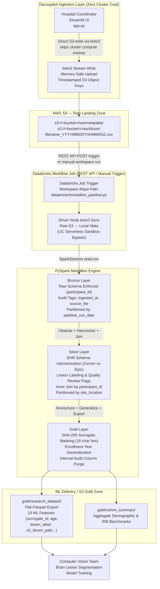
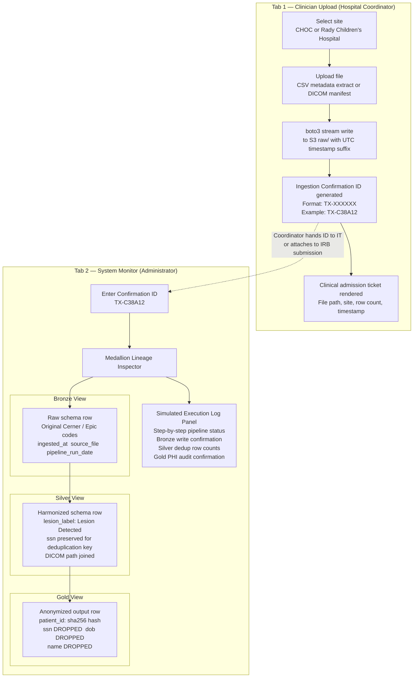

# Clinical Data Ingestion Pipeline
### Multi-Site Pediatric Neuroimaging Research Platform — CHOC (Cerner) + Rady Children's Hospital (Epic)

---

A production-grade, HIPAA Safe Harbor-compliant data engineering platform that ingests raw clinical imaging metadata and DICOM manifests from two independent pediatric hospital networks operating on heterogeneous EHR systems, unifies them through a PySpark Medallion architecture, and delivers a fully anonymized, ML-ready Parquet dataset to a downstream computer vision team training brain lesion segmentation models.

The system is designed around a **hybrid decoupled ingest pattern**: a stateless Streamlit portal handles clinical coordinator uploads and writes directly to AWS S3 (entirely independently of cluster compute), while a scheduled Databricks Workflow Job executes the transformation pipeline on demand. Neither layer has a runtime dependency on the other.

---

## Table of Contents

1. [System Architecture](#1-system-architecture)
2. [Clinical User Experience and Lineage Tracking](#2-clinical-user-experience-and-lineage-tracking)
3. [S3 Partitioning and Directory Layout](#3-s3-partitioning-and-directory-layout)
4. [Deep-Dive Technical Highlights](#4-deep-dive-technical-highlights)
   - [Serverless Compute Constraint Resolution](#41-serverless-compute-constraint-resolution)
   - [EHR Schema Standardization and Harmonization](#42-ehr-schema-standardization-and-harmonization)
   - [Cryptographic Surrogate Key Generation & Date Generalization](#43-cryptographic-surrogate-key-generation--date-generalization)
   - [Modular Testing Framework & Graceful Schema Drift Handling](#44-modular-testing-framework--graceful-schema-drift-handling)
5. [Deployment and Local Run Guide](#5-deployment-and-local-run-guide)
6. [Repository Structure](#6-repository-structure)

---

## 1. System Architecture

The architecture enforces a strict separation of concerns between ingestion, transformation, and delivery. The Streamlit portal and the Databricks compute cluster share only a storage contract: the S3 raw landing prefix, and nothing else. Cluster compute does not spin up during UI interactions, and the UI does not poll or depend on cluster state.



**Key architectural properties enforced by this design:**

| Property | Mechanism |
| --- | --- |
| **Decoupled Ingress** | Streamlit writes to S3 via `boto3`; Databricks cluster is never invoked during interactive UI uploads. |
| **Idempotency** | Bronze tables partition by `pipeline_run_date`; historical raw loads remain isolated and safely reproducible. |
| **Partition Pruning** | Silver layer partitions by `site_location`; downstream queries eliminate irrelevant hospital partitions at the storage layer. |
| **Safe Harbor Alignment** | Deterministic SHA-256 surrogate keys replace raw identifiers (`participant_id`); dates generalize to admission years. |
| **Immutable Landing** | UTC timestamp suffixes (`YYYYMMDDTHHMMSSZ`) ensure zero file overwriting across repeated coordinator uploads. |

---

## 2. Clinical User Experience and Lineage Tracking

The Streamlit application presents two role-separated tabs gated by a simple RBAC selector: one for clinical coordinators performing uploads, and one for system administrators auditing pipeline execution and tracing individual record lineage.



1. **Clinician Upload Portal (`Tab 1`):** Hospital coordinators select their affiliation network (CHOC or Rady), attach clinical CSV extracts or DICOM manifests, and submit. The application standardizes raw column headers, generates an MD5 cryptographic audit token (e.g., `TX-C38A12`), pushes the payload directly to the AWS S3 Bronze landing zone, and triggers the Databricks cluster via REST API POST requests.
2. **Internal Pipeline Monitor (`Tab 2`):** System administrators and data engineers can inspect S3 storage metrics, review directory schemas, and utilize the **Medallion Lineage Inspector**. By inputting a Confirmation ID, engineers can dynamically audit how heterogeneous hospital records transition across Bronze ingestion ledgers, Silver harmonized joins, and Gold anonymized ML research exports.
---

## 3. S3 Partitioning and Directory Layout

The AWS S3 bucket layout reflects the pipeline's data governance and access control boundaries. Immutability decreases while data refinement and anonymization increase as records advance from `raw/` to `gold/`.

```
s3://<bucket-name>/
│
├── raw/
│   ├── metadata/
│   │   └── clinical_trial_batch_001_20260623T131804Z.csv   # Immutable raw landing; timestamp-suffixed.
│   └── dicom/
│       └── dicom_manifest_20260623T140000Z.csv             # Separate landing prefix for imaging pointers.
│
├── bronze/
│   ├── metadata/
│   │   └── pipeline_run_date=2026-06-23/                   # Hive-partitioned by pipeline execution date.
│   │       └── part-0000.snappy.parquet                    # Preserves raw schema + audit lineage tags.
│   └── dicom_manifest/
│       └── pipeline_run_date=2026-06-23/
│           └── part-0000.snappy.parquet

├── silver/
│   └── clinical_imaging_joined/
│       ├── site_location=CHOC/                             # Partition pruning: CHOC queries skip Rady entirely.
│       │   └── part-0000.snappy.parquet
│       └── site_location=RADY/                             # Cleansed, harmonized, and joined on participant_id.
│           └── part-0000.snappy.parquet
││
└── gold/
    ├── research_dataset/                                   # Flat, unpartitioned Parquet export for ML ingestion.
    │   └── part-0000.snappy.parquet                        # Retains exactly 10 anonymized clinical features.
    └── cohort_summary/
        └── part-0000.snappy.parquet                        # Aggregate demographic statistics for IRB compliance reporting.

```

**Partitioning rationale by layer:**

* `bronze/<dataset>/pipeline_run_date=YYYY-MM-DD/` is partitioned by execution date to guarantee idempotent batch runs. Rerunning a pipeline job overwrites the target run date partition without accumulating duplicate historical rows.
* `silver/clinical_imaging_joined/site_location=<SITE>/` is partitioned by hospital site to enable storage-level partition pruning. When downstream researchers or computer vision models filter by a specific medical center, the Spark query planner eliminates irrelevant site folders before reading file blocks.
* `gold/research_dataset/` is unpartitioned. Because the final research dataset represents a highly condensed, focused feature export designed for sequential in-memory batch shuffling during Deep Learning model training, maintaining a flat structure avoids unnecessary partition metadata overhead.


---

## 4. Deep-Dive Technical Highlights

### 4.1 Serverless Compute Constraint Resolution

Databricks Unity Catalog Serverless compute environments enforce restricted JVM sandbox policies where standard DBFS S3 mounts (`dbutils.fs.mount`) are blocked entirely. To read local staged payloads reliably on Serverless compute without init script modifications, the pipeline executes an automated `boto3` synchronization on the driver node at job startup (`sync_s3_to_local_workspace`).


```python
import boto3
import os

s3_client = boto3.client("s3")
os.makedirs("/data", exist_ok=True)

paginator = s3_client.get_paginator("list_objects_v2")
pages = paginator.paginate(Bucket=AWS_BUCKET_NAME, Prefix="raw")

for page in pages:
    for obj in page.get("Contents", []):
        s3_key = obj["Key"]
        if not s3_key.endswith("/"):
            relative_key = s3_key[len("raw"):].lstrip("/")
            local_dest = os.path.join("/data", relative_key)
            os.makedirs(os.path.dirname(local_dest), exist_ok=True)
            s3_client.download_file(AWS_BUCKET_NAME, s3_key, local_dest)
```

This stateless pre-flight step securely pulls raw S3 landing keys into the driver's local `/data` volume, providing the PySpark CSV readers with clean, highly performant local file paths.

---

### 4.2 EHR Schema Standardization and Harmonization

CHOC utilizes Cerner EHR databases, whereas Rady Children's Hospital operates on Epic. Each software vendor encodes diagnostic findings under divergent conventions. For example, raw lesion classifications present the following split:

| Hospital Network | EHR Vendor Database | Negative / Clear Finding | Positive Lesion Finding |
| --- | --- | --- | --- |
| **CHOC** | Cerner | `-1` (String Integer) | `1` (String Integer) |
| **Rady Children's** | Epic | `NA` or `None` (String / Null) | `Positive` (String) |

Without alignment, downstream label encoders would interpret four distinct classes for a binary clinical fact. The Silver layer resolves this via PySpark conditional harmonization (`apply_lesion_harmonization`), mapping findings into canonical vocabulary:

```python
from pyspark.sql import functions as F

DIRTY_LESION_VALUES = {"-1", "NA", "na", "N/A", "n/a", "none", "None", ""}
POSITIVE_LESION_VALUES = {"1", "positive", "Positive", "POSITIVE"}

def apply_lesion_harmonization(df, col_name="lesion_status_code"):
    normalized = F.lower(F.trim(F.col(col_name)))
    is_null_or_empty = F.col(col_name).isNull() | (F.trim(F.col(col_name)) == "")
    is_dirty = normalized.isin([v.lower() for v in DIRTY_LESION_VALUES if v != ""])
    is_positive = normalized.isin([v.lower() for v in POSITIVE_LESION_VALUES])

    lesion_label = (
        F.when(is_null_or_empty | is_dirty, F.lit("No Lesion Detected"))
        .when(is_positive, F.lit("Lesion Detected"))
        .otherwise(F.lit("Pending Radiologist Review"))
    )
    return (
        df.withColumn("lesion_label", lesion_label)
        .withColumn("lesion_code_requires_review", (~(is_null_or_empty | is_dirty | is_positive)).cast("boolean"))
    )
```

Unrecognized schema variants trigger `lesion_code_requires_review = True`, surfacing vendor schema drift explicitly in data quality audit tables rather than dropping unmapped patient encounters.

---

### 4.3 Cryptographic Surrogate Key Generation & Date Generalization

To satisfy HIPAA Safe Harbor de-identification standards (45 CFR §164.514(b)) and IRB compliance requirements, records advancing into the Gold research zone undergo strict anonymization:

**1. Deterministic SHA-256 Surrogate Key Masking:**

```python
def mask_participant_id(df, id_col="participant_id"):
    return df.withColumn(
        "subject_surrogate_id",
        F.substring(F.sha2(F.col(id_col), 256), 1, 16)
    ).drop(id_col)
```

Raw identifiers (`P001`) are hashed into irreversible 16-character hexadecimal strings. The computer vision team can track longitudinal scan sequences per surrogate subject, but reversing the hash back to an unmasked identity is computationally impossible within the ML environment.

**2. Date Precision Reduction & Audit Purging:**


```python
def reduce_date_precision(df, date_col="enrollment_date"):
    return df.withColumn("enrollment_year", F.year(F.col(date_col))).drop(date_col)
```

Exact admission dates are generalized to enrollment years, and internal audit tags (`ingested_at`, `source_file`) are explicitly purged. The final Gold ML delivery table exposes exactly 10 robust research features: `subject_surrogate_id`, `age`, `site_location`, `ehr_system`, `enrollment_year`, `lesion_label`, `lesion_code_requires_review`, `imaging_s3_uri`, `modality`, and `body_region`.

---

### 4.4 Modular Testing Framework & Graceful Schema Drift Handling

The transformation engine separates core PySpark mapping logic into modular, testable Python definitions. The unit testing suite (`tests/test_pipeline.py`) natively imports transformation functions from `databricks.medallion_pipeline` to validate cross-EHR harmonization rules inside a local, headless PySpark session:


```python
import pytest
from pyspark.sql import SparkSession
from pyspark.sql.types import StructType, StructField, StringType
from databricks.medallion_pipeline import apply_lesion_harmonization

def test_apply_lesion_harmonization(spark):
    schema = StructType([StructField("raw_code", StringType(), True)])
    df = spark.createDataFrame([("-1",), ("NA",), (None,), ("1",)], schema)
    
    result_df = apply_lesion_harmonization(df, "raw_code")
    results = [row["lesion_label"] for row in result_df.collect()]
    
    assert results[0] == "No Lesion Detected"  # Cerner Negative
    assert results[1] == "No Lesion Detected"  # Epic Negative
    assert results[2] == "No Lesion Detected"  # Null handling
    assert results[3] == "Lesion Detected"     # Positive Lesion
```

The resulting `patient_id` is a deterministic 256-bit hash of the original SSN. The ML team can track longitudinal patient records by `patient_id` across scans, but the mapping from `patient_id` back to a real identity is computationally infeasible without the original SSN and a reverse-lookup table, neither of which exists in the Gold zone or is accessible to model training infrastructure.

**Step 2) PHI column drop:**

```python
PHI_COLUMNS = ["ssn", "patient_name", "date_of_birth", "mrn", "address"]

gold_df = anonymized_df.drop(*PHI_COLUMNS)
```

This lightweight architecture enables robust CI/CD pre-commit verification in seconds without requiring live cloud cluster connectivity or JVM overhead.

---

## 5. Deployment and Local Run Guide

### Prerequisites

- Python 3.10+
- Apache Spark 3.4+ (local mode for testing)
- A free AWS account with S3 read/write credentials configured via `~/.aws/credentials` or environment variables
- A free Databricks Community Edition account with a Databricks Workspace URL and Personal Access Token configured in environment or Streamlit secrets

### Clone the repository

```bash
git clone https://github.com/devyn-miller/clinical-data-ingestion-pipeline.git
cd clinical-data-ingestion-pipeline
```

### Install dependencies

```bash
pip install -r requirements.txt
```

The `requirements.txt` includes: `streamlit`, `boto3`, `pyspark`, `pytest`, `pandas`, `pyarrow`.


### Step 1) Generate Synthetic Clinical Data

```bash
python generate_data.py

```

This utility generates 500 synthetic patient records across Cerner and Epic coding conventions, saving `metadata.csv` and `dicom_manifest.csv` directly into the `./data/` directory.

### Step 2) Run the Local Unit Test Suite

```bash
pytest tests/test_pipeline.py -v

```

Expected output:

```text
tests/test_pipeline.py::test_apply_lesion_harmonization PASSED
```

The test suite validates the cross-EHR PySpark harmonization logic entirely within a local, headless Spark session. No active cloud cluster connectivity or Databricks environment is required.

### Step 3) Launch the Streamlit Ingestion Portal

```bash
streamlit run app.py
```

Navigate to `http://localhost:8501`. Use the **Clinician Upload Portal** tab to upload data extracts and receive a unique Ingestion Confirmation ID. Switch over to the **Internal Pipeline Monitor** tab to paste that ID into the Medallion Schema Lineage & Transformation Inspector to inspect how records transition across Bronze, Silver, and Gold schemas.

### Step 4) Trigger the Databricks Medallion Pipeline

Within your Databricks Workspace UI, navigate to **Workflows**, select the configured workspace job pointing to `databricks/medallion_pipeline.py`, and click **Run now**. The execution job will perform the following steps:

1. **S3 Workspace Sync:** Execute a driver-side `boto3` pagination loop to pull newest staging files from `s3://<bucket>/raw/` into the local cluster `/data` volume, bypassing Unity Catalog Serverless mounting restrictions.
2. **Bronze Ingestion:** Apply strict primitive structural definitions on read, append lineage audit markers (`ingested_at`, `source_file`), and write historical snapshots partitioned by `pipeline_run_date`.
3. **Silver Harmonization & Join:** Map inconsistent Cerner and Epic findings into a unified clinical classification space, perform data quality checks, and inner-join manifests on `participant_id`, writing outputs partitioned by `site_location`.
4. **Gold Anonymization:** Replace raw candidate keys with deterministic 16-character SHA-256 surrogate strings, drop internal audit keys, reduce date precision to enrollment years, and export flat, ML-ready Parquet datasets.

All transformation phases log precise row counts, data profiling distributions, and S3 destination endpoints directly to the stdout run tracker stream.


## 6. Repository Structure

```
clinical-data-ingestion-pipeline/
│
├── app.py                        # Streamlit RBAC portal — clinician upload + internal monitor tabs
├── generate_data.py              # Synthetic clinical data generator (Cerner & Epic EHR variants)
├── requirements.txt              # Package dependencies (including pyarrow for Parquet serialization)
│
├── databricks/
│   └── medallion_pipeline.py     # Core PySpark Medallion engine (Bronze, Silver, Gold layers)

├── tests/
│   └── test_pipeline.py          # Pytest suite validating EHR harmonization rules
│
└── data/
    └── raw/                      # Local staging directory for generated mock files
```

---

## Technology Stack

| Layer | Technology |
|---|---|
| Ingestion Portal | Python 3.10+, Streamlit, boto3 |
| Cloud Storage | AWS S3 (Hive-partitioned Parquet) |
| Orchestration | Databricks Workflow Jobs |
| Compute Engine | Apache Spark 3.4 (PySpark), Databricks Serverless |
| Testing | Pytest, Modular imports, PySpark local mode |
| De-identification | SHA-256 via PySpark `F.sha2` |
| Data Format | CSV (ingest), Snappy-compressed Parquet (output) |


---

## Compliance and Governance

This platform enforces data anonymization principles aligned with HIPAA Safe Harbor de-identification standards (45 CFR §164.514(b)). Raw patient identifiers (`participant_id`) are cryptographically masked using deterministic SHA-256 surrogate keys within the compute boundary, and exact admission dates are generalized to enrollment years prior to ML export. The raw landing prefix (`raw/`) is restricted to automated service accounts and remains isolated from downstream model training infrastructure.

---

*This project was developed as a technical portfolio artifact demonstrating production data architecture patterns for multi-site clinical research infrastructure. It does not contain real patient data.*
