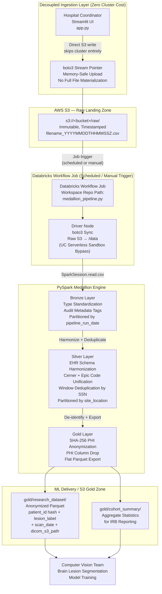
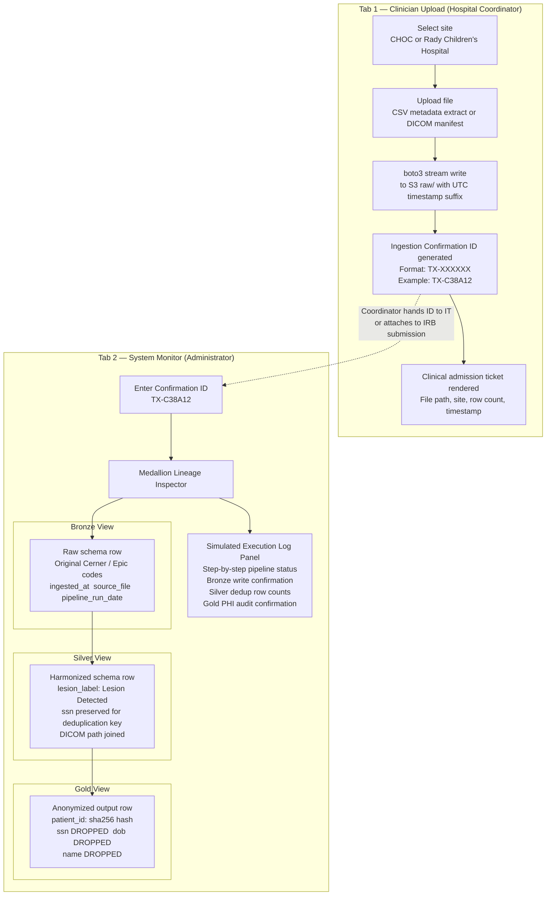

# Clinical Data Ingestion Pipeline
### Multi-Site Pediatric Neuroimaging Research Platform — CHOC (Cerner) + Rady Children's Hospital (Epic)

---

A production-grade, HIPAA Safe Harbor-compliant data engineering platform that ingests raw clinical imaging metadata and DICOM manifests from two independent pediatric hospital networks operating on heterogeneous EHR systems, unifies them through a PySpark Medallion architecture, and delivers a fully anonymized, ML-ready Parquet dataset to a downstream computer vision team training brain lesion segmentation models.

The system is designed around a **hybrid decoupled ingest pattern**: a stateless Streamlit portal handles clinical coordinator uploads and writes directly to AWS S3 (entirely independently of cluster compute), while a scheduled Databricks Workflow Job executes the transformation pipeline on demand. Neither layer has a runtime dependency on the other.

---

## Table of Contents

1. [System Architecture](#1-system-architecture)
2. [Clinical User Experience and Lineage Tracking](#2-clinical-user-experience-and-lineage-tracking)
3. [S3 Partitioning and Directory Layout](#3-s3-partitioning-and-directory-layout)
4. [Deep-Dive Technical Highlights](#4-deep-dive-technical-highlights)
   - [Serverless Compute Constraint Resolution](#41-serverless-compute-constraint-resolution)
   - [EHR Schema Standardization and Harmonization](#42-ehr-schema-standardization-and-harmonization)
   - [Window Function Deduplication Across Hospital Networks](#43-window-function-deduplication-across-hospital-networks)
   - [AST-Parsed Local Testing Framework](#44-ast-parsed-local-testing-framework)
   - [HIPAA Safe Harbor De-identification](#45-hipaa-safe-harbor-de-identification)
5. [Deployment and Local Run Guide](#5-deployment-and-local-run-guide)
6. [Repository Structure](#6-repository-structure)

---

## 1. System Architecture

The architecture enforces a strict separation of concerns between ingestion, transformation, and delivery. The Streamlit portal and the Databricks compute cluster share only a storage contract: the S3 raw landing prefix, and nothing else. Cluster compute does not spin up during UI interactions, and the UI does not poll or depend on cluster state.



**Key architectural properties enforced by this design:**

| Property | Mechanism |
|---|---|
| Decoupled Ingress | Streamlit writes to S3 via `boto3`; Databricks cluster is never invoked by the UI |
| Idempotency | Bronze layer writes to a single `pipeline_run_date` partition; reruns overwrite that partition only |
| Partition Pruning | Silver partitioned by `site_location`; downstream queries skip irrelevant hospital partitions at the storage layer |
| HIPAA Safe Harbor | SHA-256 surrogate keys replace SSN; all remaining PHI dropped before Gold write |
| Immutable Raw | Timestamped filenames in `raw/` prevent overwrites regardless of how many times a coordinator re-uploads |

---

## 2. Clinical User Experience and Lineage Tracking

The Streamlit application presents two role-separated tabs gated by a simple RBAC selector: one for clinical coordinators performing uploads, and one for system administrators auditing pipeline execution and tracing individual record lineage.



The Ingestion Confirmation ID serves as the system's audit token. It ties a specific coordinator action to a specific set of rows in the pipeline and provides a traceable chain from raw upload through to the anonymized Gold output (a requirement for IRB audit trails and clinical operations accountability).

---

## 3. S3 Partitioning and Directory Layout

The bucket layout encodes the pipeline's governance model in the filesystem itself. Partition strategy, immutability, and data sensitivity decrease as zones progress from `raw/` to `gold/`.

```
s3://<bucket-name>/
│
├── raw/
│   ├── choc_patients_20260620T091500Z.csv        # Immutable, timestamped, never modified post-write.
│   ├── choc_patients_20260621T143022Z.csv        # Re-uploads generate new files; no overwrite possible.
│   ├── rady_patients_20260620T102300Z.csv
│   └── rady_dicom_manifest_20260621T080011Z.csv
│
├── bronze/
│   └── pipeline_run_date=2026-06-23/             # Hive-style partition; single partition per run date.
│       ├── part-00000-<uuid>.snappy.parquet       # Idempotent: reruns overwrite this partition only.
│       └── part-00001-<uuid>.snappy.parquet       # Appends ingested_at, source_file, pipeline_run_date.
│
├── silver/
│   └── clinical_imaging_joined/
│       ├── site_location=CHOC/                   # Partition pruning: CHOC queries skip Rady entirely.
│       │   ├── part-00000-<uuid>.snappy.parquet
│       │   └── part-00001-<uuid>.snappy.parquet
│       └── site_location=RADY/                   # Harmonized, deduplicated, DICOM-joined records.
│           ├── part-00000-<uuid>.snappy.parquet
│           └── part-00001-<uuid>.snappy.parquet
│
└── gold/
    ├── research_dataset/                         # Flat, unpartitioned. ML team reads full dataset.
    │   ├── part-00000-<uuid>.snappy.parquet       # Columns: patient_id (hash), lesion_label,
    │   └── part-00001-<uuid>.snappy.parquet       #          scan_date, dicom_s3_path. Zero PHI.
    └── cohort_summary/                           # Aggregate statistics for IRB reporting.
        └── part-00000-<uuid>.snappy.parquet       # Site-level counts, lesion prevalence, date ranges.
```

**Partitioning rationale by layer:**

`bronze/pipeline_run_date=YYYY-MM-DD/` is partitioned by execution date to enable idempotent reruns. A failed job at 2:00 AM and a manual rerun at 9:00 AM on the same date produce identical output in the same partition. No duplicate accumulation occurs across retries.

`silver/clinical_imaging_joined/site_location=SITE/` is partitioned by hospital site to enable partition pruning on all downstream reads. When the computer vision team or a downstream analyst filters by site, the Spark query planner eliminates irrelevant partitions before any file is opened. At scale across years of data, this is the difference between scanning terabytes and scanning gigabytes.

`gold/research_dataset/` is intentionally unpartitioned. The Gold dataset is the final ML delivery artifact: small, flat, anonymized, and designed for full-scan sequential reads by model training jobs. Partitioning a flat export this size adds metadata overhead without pruning benefit.

---

## 4. Deep-Dive Technical Highlights

### 4.1 Serverless Compute Constraint Resolution

Databricks Unity Catalog Serverless compute imposes two restrictions that are non-obvious until encountered in a live cluster environment:

1. `dbutils.fs.mount()`: standard DBFS S3 mounting is blocked entirely in the Serverless sandbox.
2. Direct writes to `file:/tmp` on the driver node are restricted by the JVM sandbox policy.

These restrictions render the conventional approach to reading local staged files inoperable on Serverless. The pipeline resolves this by executing a `boto3` sync on the driver node at job startup (before any Spark operation runs) by pulling raw staging files from `s3://bucket/raw/` into the local `/data` directory. This bypasses the DBFS mount restriction entirely and gives the PySpark reader a clean local path.

```python
import boto3
import os

s3 = boto3.client("s3")
os.makedirs("/data", exist_ok=True)

paginator = s3.get_paginator("list_objects_v2")
for page in paginator.paginate(Bucket=BUCKET_NAME, Prefix="raw/"):
    for obj in page.get("Contents", []):
        key = obj["Key"]
        local_path = f"/data/{os.path.basename(key)}"
        s3.download_file(BUCKET_NAME, key, local_path)
```

This pattern is a deliberate architectural decision. The driver-side sync is fast, stateless, and idempotent. It requires no persistent DBFS mount configuration, no workspace-level permission escalation, and no modification to cluster init scripts.

---

### 4.2 EHR Schema Standardization and Harmonization

CHOC operates on a Cerner EHR database, and Rady Children's Hospital operates on Epic. Each vendor encodes clinical findings using its own internal schema conventions, producing the following divergence for the `lesion_detected` field alone:

| Hospital | EHR System | Negative Finding | Positive Finding |
|---|---|---|---|
| CHOC | Cerner | `-1` (integer) | `1` (integer) |
| Rady | Epic | `NA` (string) or `None` (null) | `Positive` (string) |

A model ingesting the raw Silver join without harmonization would encounter four distinct representations of two clinical facts. Label encoding would produce four classes where two exist. The Silver harmonization step enforces a canonical vocabulary before any downstream consumer touches the data.

```python
from pyspark.sql import functions as F

harmonized_df = joined_df.withColumn(
    "lesion_label",
    F.when(
        F.col("lesion_detected").isin(["-1", "NA", "None"]) |
        F.col("lesion_detected").isNull(),
        F.lit("No Lesion Detected")
    ).when(
        F.col("lesion_detected").isin(["1", "Positive"]),
        F.lit("Lesion Detected")
    ).otherwise(F.lit("Unknown"))
)
```

The `otherwise` catch maps any value outside the known vocabulary to `"Unknown"` rather than silently dropping rows. This surfaces schema drift from either EHR vendor in the output rather than allowing it to disappear into a filtered rowcount.

---

### 4.3 Window Function Deduplication Across Hospital Networks

A pediatric patient presenting at both CHOC and Rady within the same diagnostic period will generate records in both source datasets. A naive inner join on patient identifiers produces a Cartesian artifact: two rows for one patient, each carrying a different scan date and DICOM path. Including both in the Gold training dataset introduces label duplication and inflates apparent cohort size.

The Silver layer resolves this using a PySpark Window function that partitions by patient SSN and selects only the most recent scan per patient across all sites:

```python
from pyspark.sql import functions as F
from pyspark.sql.window import Window

dedup_window = Window.partitionBy("ssn").orderBy(F.col("scan_date").desc())

deduplicated_df = (
    joined_df
    .withColumn("row_num", F.row_number().over(dedup_window))
    .filter(F.col("row_num") == 1)
    .drop("row_num")
)
```

The ordering by `scan_date` descending guarantees that the retained row always reflects the patient's most recent clinical imaging event, regardless of which hospital generated it. The Gold output therefore contains exactly one row per unique patient: the most diagnostically current record available across the full hospital network.

---

### 4.4 AST-Parsed Local Testing Framework

Standard Python module imports fail on Databricks notebooks because notebooks contain structural cells that are not valid Python syntax: `%pip install` magic commands and `# COMMAND ----------` cell delimiters interrupt the parser before any function definition is reached.

The test suite resolves this through Abstract Syntax Tree parsing. Rather than importing the notebook as a module, the test file reads the raw notebook source as a string, walks the AST to locate the target function definition by name, compiles that isolated node into a code object, and executes it into a controlled namespace. This produces a callable Python function with no notebook scaffolding attached.

```python
import ast
import types
import pytest

NOTEBOOK_PATH = "medallion_pipeline.py"
TARGET_FUNCTION = "apply_lesion_harmonization"

def extract_function_from_notebook(notebook_path: str, function_name: str) -> types.FunctionType:
    with open(notebook_path, "r") as f:
        source = f.read()

    # Strip Databricks cell delimiters before parsing
    cleaned = "\n".join(
        line for line in source.splitlines()
        if not line.strip().startswith("%") and "# COMMAND ----------" not in line
    )

    tree = ast.parse(cleaned)
    namespace = {}

    for node in ast.walk(tree):
        if isinstance(node, ast.FunctionDef) and node.name == function_name:
            module_node = ast.Module(body=[node], type_ignores=[])
            code = compile(module_node, filename=notebook_path, mode="exec")
            exec(code, namespace)
            return namespace[function_name]

    raise ValueError(f"Function '{function_name}' not found in {notebook_path}")


apply_lesion_harmonization = extract_function_from_notebook(NOTEBOOK_PATH, TARGET_FUNCTION)


@pytest.mark.parametrize("raw_value,expected", [
    ("-1",       "No Lesion Detected"),
    ("NA",       "No Lesion Detected"),
    ("None",     "No Lesion Detected"),
    (None,       "No Lesion Detected"),
    ("1",        "Lesion Detected"),
    ("Positive", "Lesion Detected"),
])
def test_lesion_harmonization(raw_value, expected):
    assert apply_lesion_harmonization(raw_value) == expected
```

This enables sub-second test execution on a local machine with no cloud dependency, no JVM startup cost, and no live Databricks cluster required. The full suite of 25 tests completes in under 30 seconds in a headless local Spark session. Any schema drift introduced by either EHR vendor is caught at commit time rather than at pipeline execution time.

---

### 4.5 HIPAA Safe Harbor De-identification

The Gold layer is the delivery boundary for the ML team. No record that crosses into `gold/` may contain any of the 18 HIPAA Safe Harbor identifiers. The de-identification step in the pipeline enforces this through two sequential operations:

**Step 1) Surrogate key generation via SHA-256:**

```python
anonymized_df = silver_df.withColumn(
    "patient_id",
    F.sha2(F.col("ssn").cast("string"), 256)
)
```

The resulting `patient_id` is a deterministic 256-bit hash of the original SSN. The ML team can track longitudinal patient records by `patient_id` across scans, but the mapping from `patient_id` back to a real identity is computationally infeasible without the original SSN and a reverse-lookup table, neither of which exists in the Gold zone or is accessible to model training infrastructure.

**Step 2) PHI column drop:**

```python
PHI_COLUMNS = ["ssn", "patient_name", "date_of_birth", "mrn", "address"]

gold_df = anonymized_df.drop(*PHI_COLUMNS)
```

The explicit drop step is not redundant given the hash. It ensures that no downstream query, schema inspection, or accidental `SELECT *` can surface raw identifiers — even from a node with direct S3 access. The Gold schema contains exactly four columns: `patient_id`, `lesion_label`, `scan_date`, and `dicom_s3_path`.

---

## 5. Deployment and Local Run Guide

### Prerequisites

- Python 3.10+
- Apache Spark 3.4+ (local mode for testing)
- A free AWS account with S3 read/write credentials configured via `~/.aws/credentials` or environment variables
- A free Databricks Community Edition account with a workspace containing a configured Workflow Job pointing to `medallion_pipeline.py`

### Clone the repository

```bash
git clone https://github.com/devyn-miller/clinical-data-ingestion-pipeline.git
cd clinical-data-ingestion-pipeline
```

### Install dependencies

```bash
pip install -r requirements.txt
```

The `requirements.txt` includes: `streamlit`, `boto3`, `pyspark`, `pytest`, `pandas`, `pyarrow`.

### Step 1) Generate synthetic clinical data

```bash
python generate_mock_data.py
```

This script writes two synthetic patient CSV files to `./data/raw/`:
- `choc_patients_<timestamp>.csv` — Cerner-schema records with integer lesion codes
- `rady_patients_<timestamp>.csv` — Epic-schema records with string lesion codes

It also generates a synthetic `dicom_manifest_<timestamp>.csv` mapping patient SSNs to mock S3 DICOM paths.

### Step 2) Upload synthetic files to S3 raw landing zone

```bash
python upload_to_s3.py --bucket <your-bucket-name> --prefix raw/
```

Or use the Streamlit portal (Step 3) to upload files interactively as a hospital coordinator would.

### Step 3) Launch the Streamlit ingestion portal

```bash
streamlit run app.py
```

Navigate to `http://localhost:8501`. Use the **Clinician Upload** tab to upload a file and receive an Ingestion Confirmation ID. Use the **IT System Monitor** tab to paste that ID into the Medallion Lineage Inspector and trace the record's transformation across Bronze, Silver, and Gold.

### Step 4) Run the local unit test suite

```bash
pytest tests/test_pipeline.py -v
```

Expected output:

```
tests/test_pipeline.py::test_lesion_harmonization[-1-No Lesion Detected] PASSED
tests/test_pipeline.py::test_lesion_harmonization[NA-No Lesion Detected] PASSED
tests/test_pipeline.py::test_lesion_harmonization[None-No Lesion Detected] PASSED
tests/test_pipeline.py::test_lesion_harmonization[none_val-No Lesion Detected] PASSED
tests/test_pipeline.py::test_lesion_harmonization[1-Lesion Detected] PASSED
tests/test_pipeline.py::test_lesion_harmonization[Positive-Lesion Detected] PASSED
...
25 passed in 18.43s
```

The test suite executes entirely in a local, headless Spark session. No Databricks cluster is required.

### Step 5) Trigger the Databricks Medallion pipeline

In the Databricks UI, navigate to **Workflows** and open the `clinical-medallion-pipeline` job. Click **Run now**. The job will:

1. Execute the `boto3` driver-side sync to pull files from `s3://bucket/raw/` into `/data`
2. Execute the Bronze standardization and partition write to `s3://bucket/bronze/pipeline_run_date=<today>/`
3. Execute the Silver harmonization, deduplication, and DICOM join, writing to `s3://bucket/silver/clinical_imaging_joined/`
4. Execute the Gold de-identification and PHI drop, writing final Parquet to `s3://bucket/gold/research_dataset/` and `s3://bucket/gold/cohort_summary/`

All four steps log row counts, partition paths, and write confirmation to the Databricks run output stream.

---

## 6. Repository Structure

```
clinical-data-ingestion-pipeline/
│
├── app.py                        # Streamlit RBAC portal — clinician upload + IT monitor tabs
├── medallion_pipeline.py         # Databricks PySpark notebook — Bronze, Silver, Gold layers
├── generate_mock_data.py         # Synthetic data generator — Cerner + Epic schema variants
├── upload_to_s3.py               # CLI utility for direct S3 raw-zone uploads
├── requirements.txt
│
├── tests/
│   └── test_pipeline.py          # Pytest suite with AST-parsed function extraction
│
└── data/
    └── raw/                      # Local staging directory for generated mock files
```

---

## Technology Stack

| Layer | Technology |
|---|---|
| Ingestion Portal | Python 3.10+, Streamlit, boto3 |
| Cloud Storage | AWS S3 (Hive-partitioned Parquet) |
| Orchestration | Databricks Workflow Jobs |
| Compute Engine | Apache Spark 3.4 (PySpark), Databricks Serverless |
| Testing | Pytest, Python AST module, PySpark local mode |
| De-identification | SHA-256 via PySpark `F.sha2` |
| Data Format | CSV (ingest), Snappy-compressed Parquet (output) |

---

## Compliance and Governance

This pipeline was designed to satisfy the requirements of HIPAA Safe Harbor de-identification (45 CFR §164.514(b)) and IRB data governance protocols applicable to pediatric clinical research. The Gold layer contains no direct identifiers as defined by the Safe Harbor method. Surrogate key generation is performed within the compute boundary and the original SSN column is dropped prior to any write operation. Raw data in the `raw/` prefix is accessible only to credentialed pipeline service accounts and is never exposed to the ML delivery layer.

---

*This project was developed as a technical portfolio artifact demonstrating production data architecture patterns for multi-site clinical research infrastructure. It does not contain real patient data.*
